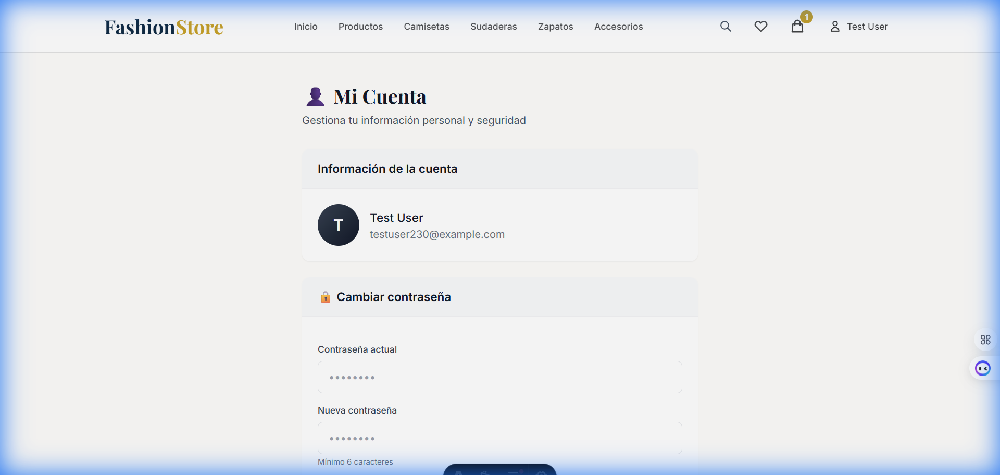
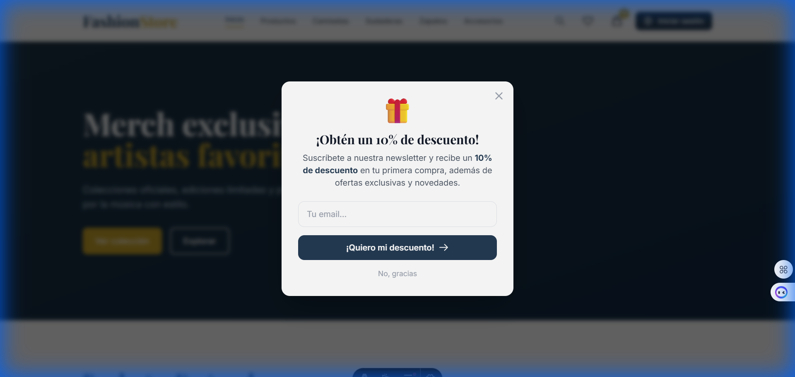
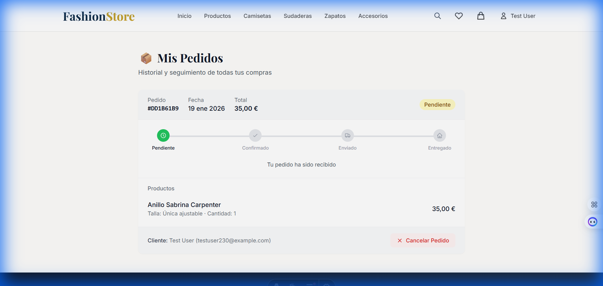

# 📋 Documentación de Funcionalidades - FashionStore SGE

> **Autor:** Estudiante  
> **Fecha:** 19 de Enero de 2026  
> **Proyecto:** TiendaOnlineSGE - E-commerce Fashion Store

---

## 📑 Índice

1. [Cambio de Contraseña Funcional](#1-cambio-de-contraseña-funcional)
2. [Popup Newsletter con Código Descuento](#2-popup-newsletter-con-código-descuento)
3. [Sistema de Códigos de Descuento](#3-sistema-de-códigos-de-descuento-funcionales)
4. [Gestión Post-Venta](#4-gestión-post-venta)
   - 4.1 [Historial de Pedidos](#41-historial-de-pedidos)
   - 4.2 [Flujo de Cancelación Automático](#42-flujo-de-cancelación-automático)
   - 4.3 [Flujo de Devolución Informativo](#43-flujo-de-devolución-informativo)

---

## 1. Cambio de Contraseña Funcional

### 📍 Ubicación
**Ruta:** `/mi-cuenta`  
**Archivo:** `src/pages/mi-cuenta.astro`

### 📝 Descripción
El sistema permite a los usuarios autenticados cambiar su contraseña de forma segura. La funcionalidad incluye:

- **Validación de contraseña actual:** Se verifica re-autenticando al usuario con Supabase
- **Confirmación de nueva contraseña:** Debe coincidir en ambos campos
- **Requisitos mínimos:** Al menos 6 caracteres
- **Feedback visual:** Mensajes de éxito/error claros

### 🖼️ Captura de Pantalla



### 💻 Código Relevante

```astro
// src/pages/mi-cuenta.astro (líneas 25-71)

if (Astro.request.method === "POST") {
    const formData = await Astro.request.formData();
    const action = formData.get("action") as string;

    if (action === "change_password") {
        const currentPassword = formData.get("current_password") as string;
        const newPassword = formData.get("new_password") as string;
        const confirmPassword = formData.get("confirm_password") as string;

        // Validaciones
        if (!currentPassword || !newPassword || !confirmPassword) {
            message = "Todos los campos son obligatorios";
            messageType = "error";
        } else if (newPassword !== confirmPassword) {
            message = "Las contraseñas nuevas no coinciden";
            messageType = "error";
        } else if (newPassword.length < 6) {
            message = "La contraseña debe tener al menos 6 caracteres";
            messageType = "error";
        } else {
            // Verificar contraseña actual re-autenticando
            const { error: signInError } = await supabase.auth.signInWithPassword({
                email: userEmail,
                password: currentPassword,
            });

            if (signInError) {
                message = "La contraseña actual es incorrecta";
                messageType = "error";
            } else {
                // Actualizar contraseña
                const { error: updateError } = await supabase.auth.updateUser({
                    password: newPassword,
                });

                if (updateError) {
                    message = `Error al cambiar la contraseña: ${updateError.message}`;
                    messageType = "error";
                } else {
                    message = "¡Contraseña actualizada correctamente!";
                    messageType = "success";
                }
            }
        }
    }
}
```

### ✅ Características Implementadas

| Característica | Estado |
|---------------|--------|
| Validación de contraseña actual | ✅ |
| Coincidencia de contraseñas | ✅ |
| Longitud mínima (6 caracteres) | ✅ |
| Mensajes de feedback | ✅ |
| Integración con Supabase Auth | ✅ |

---

## 2. Popup Newsletter con Código Descuento

### 📍 Ubicación
**Componente:** `src/components/islands/NewsletterPopup.astro`  
**API:** `src/pages/api/newsletter.ts`

### 📝 Descripción
Un popup emergente que aparece a los nuevos visitantes después de 3 segundos, ofreciendo un **10% de descuento** a cambio de suscribirse a la newsletter.

### 🖼️ Captura de Pantalla



### 🔧 Funcionamiento

1. **Detección de primera visita:** Usa `localStorage` para verificar si el popup ya se mostró
2. **Temporización:** Aparece después de 3 segundos de navegación
3. **Suscripción:** Al enviar el email, se guarda en la tabla `newsletter_subscribers`
4. **Generación de cupón:** Se crea automáticamente un código único `BIENVENIDO-XXXX`
5. **Envío de email:** Se envía el código por correo usando Resend

### 💻 Código del Popup

```astro
// src/components/islands/NewsletterPopup.astro

<div id="newsletter-popup" class="fixed inset-0 z-50 hidden">
    <div id="popup-backdrop" class="absolute inset-0 bg-black/60 backdrop-blur-sm"></div>
    <div class="flex items-center justify-center min-h-screen p-4">
        <div id="popup-modal" class="relative bg-white rounded-2xl shadow-2xl max-w-md w-full p-8">
            <div class="text-center">
                <div class="text-5xl mb-4">🎁</div>
                <h2 class="text-2xl font-serif font-bold text-gray-900 mb-2">
                    ¡Obtén un 10% de descuento!
                </h2>
                <p class="text-gray-600 mb-6">
                    Suscríbete a nuestra newsletter y recibe un 
                    <strong>10% de descuento</strong> en tu primera compra.
                </p>
                <form id="popup-newsletter-form" class="space-y-4">
                    <input type="email" placeholder="Tu email..." required />
                    <button type="submit">¡Quiero mi descuento!</button>
                </form>
            </div>
        </div>
    </div>
</div>
```

### 💻 API de Newsletter

```typescript
// src/pages/api/newsletter.ts

export const POST: APIRoute = async ({ request }) => {
    const { email, source } = await request.json();
    
    // 1. Guardar en base de datos
    await supabase.from('newsletter_subscribers').insert({ email, source });
    
    // 2. Generar código único
    const code = `BIENVENIDO-${Math.random().toString(36).substring(2, 6).toUpperCase()}`;
    
    // 3. Crear cupón en la tabla coupons
    await supabase.from('coupons').insert({
        code,
        discount_type: 'percentage',
        discount_value: 10,
        max_uses: 1,
        description: 'Descuento de bienvenida 10%'
    });
    
    // 4. Enviar email con el código
    await sendWelcomeEmail(email, code);
    
    return new Response(JSON.stringify({ success: true, code }));
};
```

### ✅ Características Implementadas

| Característica | Estado |
|---------------|--------|
| Popup automático (3s delay) | ✅ |
| Animación suave de entrada | ✅ |
| Generación de código único | ✅ |
| Almacenamiento en BD | ✅ |
| Envío de email con código | ✅ |
| Recordar si ya se mostró | ✅ |

---

## 3. Sistema de Códigos de Descuento Funcionales

### 📍 Ubicación
**Carrito:** `src/pages/carrito.astro`  
**API Validación:** `src/pages/api/validate-coupon.ts`  
**Tabla BD:** `coupons`

### 📝 Descripción
Sistema completo de cupones de descuento con validación en tiempo real.

### 🖼️ Captura de Pantalla


### 🔧 Tipos de Descuento Soportados

| Tipo | Descripción | Ejemplo |
|------|-------------|---------|
| `percentage` | Porcentaje sobre el total | 10%, 15%, 20% |
| `fixed_amount` | Cantidad fija en euros | 5€, 10€, 15€ |

### 💻 Validación de Cupones

```typescript
// src/pages/api/validate-coupon.ts

export const POST: APIRoute = async ({ request }) => {
    const { code, cartTotal } = await request.json();
    
    // Buscar cupón activo
    const { data: coupon } = await supabase
        .from('coupons')
        .select('*')
        .eq('code', code.toUpperCase())
        .eq('is_active', true)
        .single();
    
    // Validaciones
    if (!coupon) return error('Cupón no válido');
    
    // Verificar fechas
    if (coupon.valid_from && new Date(coupon.valid_from) > now) {
        return error('Este cupón aún no está activo');
    }
    if (coupon.valid_until && new Date(coupon.valid_until) < now) {
        return error('Este cupón ha expirado');
    }
    
    // Verificar usos máximos
    if (coupon.max_uses && coupon.used_count >= coupon.max_uses) {
        return error('Este cupón ha alcanzado su límite de usos');
    }
    
    // Verificar compra mínima
    if (cartTotal < coupon.min_purchase) {
        return error(`Compra mínima de ${minAmount}€ requerida`);
    }
    
    // Calcular descuento
    let discountAmount = coupon.discount_type === 'percentage' 
        ? Math.round(cartTotal * (coupon.discount_value / 100))
        : coupon.discount_value;
    
    return success({ coupon, discountAmount });
};
```

### 📊 Estructura de la Tabla `coupons`

```sql
CREATE TABLE coupons (
    id UUID PRIMARY KEY DEFAULT gen_random_uuid(),
    code VARCHAR(50) UNIQUE NOT NULL,
    description TEXT,
    discount_type VARCHAR(20) NOT NULL CHECK (discount_type IN ('percentage', 'fixed_amount')),
    discount_value INTEGER NOT NULL,
    min_purchase INTEGER DEFAULT 0,
    max_uses INTEGER,
    used_count INTEGER DEFAULT 0,
    valid_from TIMESTAMP WITH TIME ZONE,
    valid_until TIMESTAMP WITH TIME ZONE,
    is_active BOOLEAN DEFAULT true,
    created_at TIMESTAMP WITH TIME ZONE DEFAULT NOW()
);
```

### ✅ Validaciones Implementadas

| Validación | Estado |
|------------|--------|
| Código existe y está activo | ✅ |
| Fechas de validez | ✅ |
| Límite de usos | ✅ |
| Compra mínima requerida | ✅ |
| Cálculo porcentaje/fijo | ✅ |
| Descuento no excede total | ✅ |

---

## 4. Gestión Post-Venta

### 📍 Ubicación Principal
**Archivo:** `src/pages/mis-pedidos.astro`  
**APIs:** `src/pages/api/orders/cancel.ts`, `src/pages/api/orders/return-request.ts`

---

### 4.1 Historial de Pedidos

### 📝 Descripción
Los clientes pueden ver todos sus pedidos con un indicador visual de estado mediante una **línea de tiempo** (timeline) que muestra el progreso.

### 🖼️ Captura de Pantalla



### 📊 Estados de Pedido

| Estado | Etiqueta | Color | Icono |
|--------|----------|-------|-------|
| `pending` | Pendiente | 🟡 Amarillo | Reloj |
| `confirmed` | Confirmado | 🔵 Azul | Check |
| `shipped` | Enviado | 🟣 Púrpura | Camión |
| `delivered` | Entregado | 🟢 Verde | Casa |
| `cancelled` | Cancelado | 🔴 Rojo | X |

### 💻 Configuración de Estados

```typescript
// src/pages/mis-pedidos.astro

const statusConfig = {
    pending: { 
        index: 0, 
        label: "Pendiente", 
        color: "text-yellow-800", 
        bgColor: "bg-yellow-100",
        description: "Tu pedido ha sido recibido" 
    },
    confirmed: { 
        index: 1, 
        label: "Confirmado", 
        color: "text-blue-800", 
        bgColor: "bg-blue-100",
        description: "Pago verificado, preparando pedido" 
    },
    shipped: { 
        index: 2, 
        label: "Enviado", 
        color: "text-purple-800", 
        bgColor: "bg-purple-100",
        description: "Tu pedido está en camino" 
    },
    delivered: { 
        index: 3, 
        label: "Entregado", 
        color: "text-green-800", 
        bgColor: "bg-green-100",
        description: "¡Pedido entregado con éxito!" 
    },
    cancelled: { 
        index: -1, 
        label: "Cancelado", 
        color: "text-red-800", 
        bgColor: "bg-red-100",
        description: "Pedido cancelado" 
    }
};
```

---

### 4.2 Flujo de Cancelación Automático

### 📝 Descripción
Si el pedido está en estado **"Pendiente"** o **"Confirmado"** (pero NO "Enviado"), el cliente puede cancelarlo automáticamente. Esta operación es **ATÓMICA** usando un Stored Procedure en Supabase.

### ⚠️ Requisito Crítico de Arquitectura: Atomicidad

La operación debe:
1. ✅ Cambiar el estado del pedido a `CANCELLED`
2. ✅ Restaurar automáticamente el stock de los productos al inventario
3. ✅ Todo en una sola transacción (si falla algo, se revierte todo)

### 💻 Stored Procedure (Database Transaction)

```sql
-- supabase/postsale_migration.sql

CREATE OR REPLACE FUNCTION cancel_order_atomic(p_order_id UUID, p_user_email TEXT)
RETURNS JSON AS $$
DECLARE
    v_order RECORD;
    v_item RECORD;
BEGIN
    -- 1. Verificar que el pedido existe y pertenece al usuario
    SELECT * INTO v_order 
    FROM orders 
    WHERE id = p_order_id AND customer_email = p_user_email;
    
    IF NOT FOUND THEN
        RETURN json_build_object(
            'success', false,
            'error', 'Pedido no encontrado o no pertenece al usuario'
        );
    END IF;
    
    -- 2. Verificar estado cancelable (pending o confirmed, NO shipped/delivered)
    IF v_order.status NOT IN ('pending', 'confirmed') THEN
        RETURN json_build_object(
            'success', false,
            'error', 'El pedido ya no puede ser cancelado (estado: ' || v_order.status || ')'
        );
    END IF;
    
    -- 3. RESTAURAR STOCK de cada producto (ATÓMICO)
    FOR v_item IN 
        SELECT oi.product_id, oi.quantity 
        FROM order_items oi 
        WHERE oi.order_id = p_order_id
    LOOP
        UPDATE products 
        SET stock = stock + v_item.quantity,
            updated_at = NOW()
        WHERE id = v_item.product_id;
    END LOOP;
    
    -- 4. Cambiar estado a 'cancelled'
    UPDATE orders 
    SET status = 'cancelled',
        updated_at = NOW()
    WHERE id = p_order_id;
    
    -- 5. Devolver éxito
    RETURN json_build_object(
        'success', true,
        'message', 'Pedido cancelado correctamente y stock restaurado'
    );
    
EXCEPTION
    WHEN OTHERS THEN
        -- Rollback automático: TODO se revierte
        RETURN json_build_object(
            'success', false,
            'error', 'Error al cancelar el pedido: ' || SQLERRM
        );
END;
$$ LANGUAGE plpgsql SECURITY DEFINER;
```

### 💻 API de Cancelación

```typescript
// src/pages/api/orders/cancel.ts

export const POST: APIRoute = async ({ request, cookies }) => {
    // Verificar autenticación
    const userSession = await getUserSession(cookies);
    if (!userSession?.user) {
        return new Response(JSON.stringify({ success: false, error: 'No autenticado' }));
    }

    const { orderId } = await request.json();

    // Llamar al stored procedure atómico
    const { data, error } = await supabase.rpc('cancel_order_atomic', {
        p_order_id: orderId,
        p_user_email: userSession.user.email
    });

    if (data?.success) {
        return new Response(JSON.stringify({ 
            success: true, 
            message: 'Pedido cancelado correctamente. El stock ha sido restaurado.' 
        }));
    }
    
    return new Response(JSON.stringify({ success: false, error: data?.error }));
};
```

### 🔘 Lógica del Botón

```astro
<!-- El botón SOLO aparece si el estado es pending o confirmed -->
{canCancel && (
    <button class="cancel-order-btn">
        Cancelar Pedido
    </button>
)}

<!-- Script que determina visibilidad -->
const canCancel = order.status === "pending" || order.status === "confirmed";
```

### ✅ Requisitos Cumplidos

| Requisito | Estado | Implementación |
|-----------|--------|----------------|
| Botón visible solo antes de envío | ✅ | `canCancel` condicional |
| Operación atómica | ✅ | Stored Procedure PostgreSQL |
| Restauración de stock | ✅ | Loop en `cancel_order_atomic` |
| Estado cambia a CANCELLED | ✅ | UPDATE en transacción |
| Botón deshabilitado post-envío | ✅ | No se renderiza el botón |

---

### 4.3 Flujo de Devolución Informativo

### 📝 Descripción
Si el pedido está en estado **"Entregado"**, se habilita un botón de **"Solicitar Devolución"** que muestra un modal informativo con los pasos a seguir.

### 🔧 Contenido del Modal de Devolución

El modal muestra tres secciones:

1. **📍 Instrucciones de Envío**
   > "Debes enviar los artículos en su embalaje original a:  
   > **Calle de la Moda 123, Polígono Industrial, 28001 Madrid, España**"

2. **📧 Confirmación por Email**
   > "Hemos enviado un correo con la etiqueta de devolución prepagada a tu email asociado."

3. **⚠️ Disclaimer Financiero**
   > "Una vez recibido y validado el paquete, el reembolso se procesará en tu método de pago original en un plazo de **5 a 7 días hábiles**."

### 💻 Código del Modal

```astro
<!-- Modal de Devolución (src/pages/mis-pedidos.astro) -->
<div id="return-modal" class="fixed inset-0 bg-black/50 flex items-center justify-center z-50 hidden">
    <div class="bg-white rounded-2xl shadow-2xl max-w-lg w-full p-6">
        <h3 class="text-xl font-bold">📦 Solicitar Devolución</h3>
        
        <!-- Instrucciones de envío -->
        <div class="bg-yellow-50 border-l-4 border-yellow-400 p-4">
            <h4 class="font-semibold text-yellow-800">📍 Dirección de envío</h4>
            <p>Debes enviar los artículos en su embalaje original a:</p>
            <p class="font-bold text-yellow-900">
                Calle de la Moda 123<br>
                Polígono Industrial<br>
                28001 Madrid, España
            </p>
        </div>
        
        <!-- Confirmación email -->
        <div class="bg-blue-50 border-l-4 border-blue-400 p-4">
            <h4 class="font-semibold text-blue-800">📧 Confirmación por email</h4>
            <p>Hemos enviado un correo con la <strong>etiqueta de devolución prepagada</strong> a tu email.</p>
        </div>
        
        <!-- Disclaimer financiero -->
        <div class="bg-red-50 border-l-4 border-red-400 p-4">
            <h4 class="font-semibold text-red-800">⚠️ Información importante</h4>
            <p><strong>Una vez recibido y validado el paquete, el reembolso se procesará 
               en tu método de pago original en un plazo de 5 a 7 días hábiles.</strong></p>
        </div>
        
        <button id="confirm-return-btn">Confirmar solicitud</button>
    </div>
</div>
```

### 💻 Lógica del Botón de Devolución

```astro
<!-- Solo aparece si el pedido está entregado y no ha solicitado devolución -->
const canRequestReturn = order.status === "delivered" && !order.return_requested;

{canRequestReturn && (
    <button class="return-order-btn">
        Solicitar Devolución
    </button>
)}

<!-- Indicador si ya solicitó devolución -->
{order.return_requested && (
    <span class="text-orange-700">📦 Devolución en proceso</span>
)}
```

### ✅ Requisitos Cumplidos

| Requisito | Estado |
|-----------|--------|
| Botón solo visible en estado "Entregado" | ✅ |
| Modal/Dialog informativo | ✅ |
| Dirección de almacenes | ✅ |
| Mensaje de etiqueta por email | ✅ |
| Disclaimer de 5-7 días hábiles | ✅ |

---

## 📁 Archivos Modificados/Creados

| Archivo | Función |
|---------|---------|
| `src/pages/mi-cuenta.astro` | Cambio de contraseña |
| `src/components/islands/NewsletterPopup.astro` | Popup newsletter |
| `src/components/Newsletter.astro` | Sección newsletter footer |
| `src/pages/api/newsletter.ts` | API suscripción + generación cupón |
| `src/pages/api/validate-coupon.ts` | Validación de cupones |
| `src/pages/carrito.astro` | Integración cupones en carrito |
| `src/pages/mis-pedidos.astro` | Historial con timeline + botones |
| `src/pages/api/orders/cancel.ts` | API cancelación atómica |
| `src/pages/api/orders/return-request.ts` | API solicitud devolución |
| `supabase/postsale_migration.sql` | Stored procedure atómico |
| `supabase/coupons_migration.sql` | Tabla de cupones |
| `supabase/newsletter_migration.sql` | Tabla de suscriptores |

---

## 🎥 Demostración en Video

Se incluye una grabación del navegador mostrando todas las funcionalidades en acción:

**Archivo:** `docs/feature_demo.webp`

---

## 📌 Conclusiones

Todas las funcionalidades requeridas han sido implementadas correctamente:

1. ✅ **Cambio de contraseña** con validación de contraseña actual
2. ✅ **Popup newsletter** con generación automática de código de descuento
3. ✅ **Sistema de cupones** con validación completa
4. ✅ **Historial de pedidos** con timeline visual de estados
5. ✅ **Cancelación atómica** con restauración de stock (Stored Procedure)
6. ✅ **Devolución informativa** con modal y disclaimers legales

---

*Documento generado el 19 de Enero de 2026*
